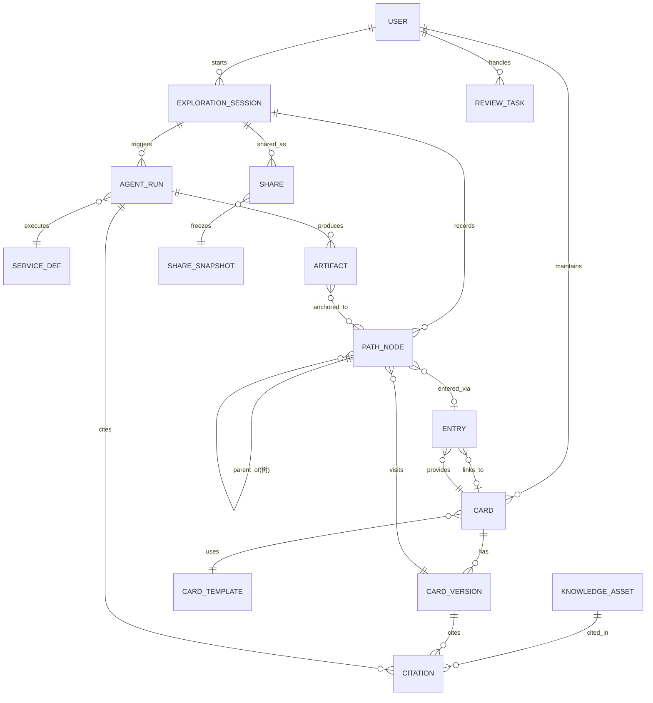

# 02 技术架构（Java 技术栈）

> 设计基调：**小团队（3 开发）、12 周 MVP、单机起步、Java 技术栈**。所有选型优先"成熟、一体化、可云可自托管"，明确写出每个决策的备选与演进触发条件，避免过度设计。

---

## 1. 总体原则

1. **模块化单体，不上微服务**——一期 3 人团队，拆微服务只会增加运维成本。模块间用 Maven 模块 + Service 接口约束，为二期拆分预留缝（先拆 worker，再拆检索）。
2. **LLM 走云 API 起步**——用国产大模型 API（GLM / Qwen / DeepSeek，OpenAI 兼容协议）零 GPU 成本起步；用量验证后再评估 vLLM 自托管切换（见 §10.3）。
3. **关系库一专多能**——PostgreSQL 同时承担关系数据、全文检索、向量检索（pgvector），不引入 ES/Milvus 等独立中间件。
4. **智能体不做自主规划**——MVP 的"智能体"是**固定流水线 + 结构化输出**（路由→检索→生成→校验），不是自主循环 Agent。可控、可测、可计费。
5. **配置即数据**——卡片、入口、服务定义全部是数据库配置，不改代码就能上新专题。
6. **善用虚拟线程，不引入响应式**——Java 21 虚拟线程让 LLM 阻塞式调用（数秒级 IO）可以按同步写法实现、按高并发运行，**避免 WebFlux 响应式的复杂度**，这是本架构 Java 侧最重要的可实现性决策。

## 2. 架构总览

```
┌────────────────────────────────────────────────────────────┐
│ 客户端层                                                     │
│  探索端 H5 (Vue3 + Vant)      工作台 Web (Vue3 + Element Plus) │
│  分享页（免登录 H5，同一前端工程的路由分支）                      │
└──────────────┬─────────────────────────────┬───────────────┘
               │ HTTPS                       │
┌──────────────▼─────────────────────────────▼───────────────┐
│ Nginx：静态资源 / 反向代理 / 限流 / 分享链接短链               │
└──────────────┬─────────────────────────────────────────────┘
┌──────────────▼─────────────────────────────────────────────┐
│ 应用层 —— Spring Boot 3 模块化单体（Java 21，虚拟线程开启）     │
│  ┌────┐┌────┐┌────┐┌────┐┌────┐┌────┐                      │
│  │卡片 ││探索 ││服务 ││入口 ││分享 ││内容 │   auth / quota   │
│  │模块 ││路径 ││编排 ││编排 ││快照 ││运营 │   (横切)          │
│  └─┬──┘└─┬──┘└─┬──┘└─┬──┘└─┬──┘└─┬──┘                      │
│    └──────┴─────┴──┬──┴──────┴──────┘                       │
│           ┌────────▼──────────┐    ┌─────────────────┐     │
│           │ LLM 网关（Spring AI │    │ 引用校验/合规/计量 │     │
│           │ ChatClient 封装）   │    │ (后处理管道)      │     │
│           │ 路由·重试·缓存      │    └─────────────────┘     │
│           └───────────────────┘                              │
└────────────────────┬────────────────────────────────────────┘
                     │ 提交任务（agent_run 状态表）
┌────────────────────▼────────────────────────────────────────┐
│ 异步执行器：@Async + 虚拟线程池（智能体任务执行）                 │
│ 同一镜像、独立 worker 容器（SPRING_PROFILES_ACTIVE=worker）      │
│ 超时控制 Resilience4j · 卡死任务由 @Scheduled 心跳回收           │
└──────────────┬──────────────────────────────────────────────┘
┌──────────────▼──────────────────────────────────────────────┐
│ 数据层                                                        │
│  PostgreSQL 15（业务数据 + pgvector 向量 + 全文检索）            │
│  Redis（配额/限流计数 / 结果缓存 / 会话缓存）                    │
│  MinIO（图片音视频对象存储，S3 协议，minio-java 客户端）          │
│  ※ 二期图片功能落地改为本地磁盘存储（ke.upload.dir，见下选型表）   │
└─────────────────────────────────────────────────────────────┘
```

## 3. 技术选型

| 层 | 选型 | 理由 | 备选 / 备注 |
|----|------|------|------------|
| 语言/JDK | Java 21 LTS（`--enable-preview` 不用，正式特性虚拟线程） | 最普及 LTS；虚拟线程解决 LLM 长阻塞 IO 并发 | Java 25 LTS（新 LTS，可评估） |
| 框架 | Spring Boot 3.5+ + Spring MVC | 生态最全、招人最易；同步阻塞模型 + 虚拟线程 | WebFlux（明确不选，复杂度高收益小） |
| 构建 | Maven 多模块（3.6.3+） | 团队已有 Maven 环境；多模块划清边界 | Gradle |
| ORM | MyBatis-Plus | 国内主流、SQL 可控；路径树等复杂查询直接写 PG 递归 CTE | Spring Data JPA（简单 CRUD 更快，两者可混用：JPA 管简单表、MyBatis 管复杂查询） |
| 迁移 | Flyway | Java 生态标准，SQL 即版本 | Liquibase |
| 异步任务 | `@Async` + 虚拟线程池 + `agent_run` 状态表驱动 | 见 §5.1：**不引入 MQ 即可获得持久化/重试/可观测** | RocketMQ（P2 演进，见 §10.4） |
| LLM 编排 | Spring AI 1.x（OpenAI 兼容 ChatClient + PgVectorStore + 结构化输出） | 与 Spring 一体；`base-url` 可切云 API / 内网 vLLM | LangChain4j（功能更全，Spring AI 不满足时切换） |
| 容错/限流 | Resilience4j（TimeLimiter/Retry）+ Redis INCR 配额 | LLM 调用超时重试、用户日配额 | Sentinel（更重，二期集群时再评估） |
| 认证授权 | Spring Security + JWT + `@PreAuthorize` | RBAC 四角色方法级控制 | Sa-Token（国内流行，若团队更熟可换） |
| 缓存 | Spring Cache（Redis）+ Caffeine 本地一级 | 结果缓存/卡片热点缓存 | — |
| API 文档 | springdoc-openapi（Swagger UI） | 前端用 openapi-generator 生成 TS 类型，两端 schema 单一来源 | — |
| 对象存储 | MinIO（minio-java / S3 SDK）；**二期图片功能实际落地为本地磁盘存储**：`ke.upload.dir`（prod 强制 `KE_UPLOAD_DIR` 注入数据盘目录），文件按 `{yyyy}/{MM}/{uuid}.{ext}` 落盘、DB `card_image` 只记元数据，魔数白名单 JPG/PNG/GIF/WebP ≤5MB | 图片/音频/快照附件 | 云 OSS 直接替换 endpoint；`ImageService` 为唯一存储接缝，切 MinIO/OSS 只替换该实现 |
| 测试 | JUnit 5 + Testcontainers（PG/Redis）+ MockWebServer（mock LLM） | 核心路径（服务流水线/引用校验/权限过滤）必须有集成测试 | — |
| 前端 | **双端统一 Vue3 + Vite**：探索端 Vant（移动 H5），工作台 Element Plus（中后台） | 3 人团队一套技能与工具链；pnpm monorepo 共享 openapi 生成类型与公共组件；分享页同工程免登录路由 | 工作台备选 Ant Design Vue（团队偏好 AntD 风格时）；小程序二期用 uni-app 包装 |

## 4. 核心数据模型

### 4.1 ER 图



### 4.2 关键表与设计决策

| 表 | 关键字段 | 设计决策 |
|----|---------|---------|
| `card` | id, theme, template_type, title, status(draft/pending/published/disabled), current_version_id, maintainer_id, sort | 状态机由审核模块驱动；探索者只读 `published` |
| `card_version` | id, card_id, version_no, **content_json(不可变)**, sources, created_by | 版本一旦创建不允许修改（DB 层触发器或代码层只允许 INSERT）；所有引用都指向具体版本 → 回溯可复现（方案"内容版本与探索实例分别保存"的落地） |
| `entry`（入口） | id, card_id, name, type(`link_card`/`agent_service`/`compare`), relation_label, target_card_id, service_type, config_json, scope(private/public), status, version, author_id | **一期入口只有 3 类白名单类型**；`config_json` = {goal, input_schema, context_policy, output_spec}；公共入口走 review |
| `knowledge_asset` | id, kind(book/article/audio/video), title, source_meta, locator(jsonb: 卷/章/页/时间戳), license, license_expire, content_extract, embedding | 引用的最小单元，"出处可定位"的载体；授权到期自动从检索摘除 |
| `citation` | id, asset_id, locator, quote, object_type(card_version/agent_run), object_id | 统一引用结构；服务输出与卡片内容共用 |
| `exploration_session` | id, user_id, theme, goal, explain_level(simple/deep/child), status, **origin_share_id** | `origin_share_id` 非空 = 接续副本（验收 A5）；上下文按会话隔离 |
| `path_node` | id, session_id, **parent_node_id**, card_version_id, entry_id, question_text, is_new_knowledge, visited_at | **分支不建表**：`parent_node_id` 自然成树；子树查询用 PG 递归 CTE（MyBatis 原生 SQL）；`is_new_knowledge` 埋点时计算，服务"有效深入率" |
| `agent_run` | id, session_id, node_id, service_type, input_json, status(queued/running/done/failed/timeout), artifact_ids, model, tokens_in/out, cost, latency_ms, error, heartbeat_at | **既是执行记录又是任务队列**：提交即 INSERT(queued)，执行器认领更新状态；同时服务成本计量与指标统计 |
| `artifact`（成果） | id, session_id, type(report/card_group/task_record), content_json, cited_run_ids, status | 成果整理服务的产物；分享的素材 |
| `share` / `share_snapshot` | share: id, token(nanoid), object_type, visibility, revoked; snapshot: **不可变 JSON** | 快照=权限过滤后的完整投影；接续=按快照复制新 session；源卡停用时快照仍可读并标不可用节点 |
| `review_task` | id, object_type(card/entry), object_id, action, status, reviewer_id, notes | 人工审核队列 |

> 为什么不用图数据库：路径是严格的访问树（每节点单父），关系（卡片间"深入了解/相关联"）基数低且存于 `entry`，PG 完全够；MVP 引入图数据库只会拖慢交付。

### 4.3 模板内容结构（`content_json` 约定）

```jsonc
// 图文卡
{ "summary": "首屏摘要 ≤120 字", "sections": [{"h": "…", "body": "…", "citations": [1,2]}],
  "related": [{"card_id": 12, "relation": "相关联", "why": "同为宋代书院", "source": 3}] }

// 对比卡
{ "objects": ["剁椒鱼头", "清蒸鲈鱼"], "dimensions": ["食材", "技法", "风味", "适用场景"],
  "cells": [["…","…"], …], "citations": [...] }

// 时间线卡
{ "events": [{"year": "976", "title": "创办", "body": "…", "card_id": 21, "citations": [...]}] }

// 任务与成果卡
{ "goal": "60 分钟家庭文化探索", "steps": [{"place": "大门", "observe": "观察题刻…", "minutes": 10}],
  "record_schema": ["文本", "照片"] }
```

Java 侧每类模板对应一个 `CardContent` POJO（Jackson 绑定 + jakarta.validation 注解校验），工作台保存前校验，脏数据进不了库。

### 4.4 后端工程结构（Maven 多模块）

```
knowledge-explorer/
├── pom.xml                    # 父 POM：依赖版本、插件管理
├── ke-domain/                 # 实体、值对象、领域服务接口（无 Spring 依赖）
├── ke-infra/                  # MyBatis-Plus mapper、Redis/MinIO/Spring AI 封装
├── ke-service/                # 六大业务模块 + LLM 网关 + 后处理管道
│   └── card / explore / agent / entry / share / content
└── ke-boot/                   # Spring Boot 启动模块（web + worker 共用）
    └── src/main/resources/application-{web,worker}.yml
```

要点：
- `ke-domain` 不依赖 Spring，保证核心规则（引用校验、状态机、权限过滤）可独立单测；
- worker 与 web 是**同一 jar、不同 profile**：`SPRING_PROFILES_ACTIVE=worker` 时关闭 web 端口、只启动异步执行器与定时回收，扩容只加 worker 容器。

## 5. 关键流程

### 5.1 讲解服务执行（异步，替代 MQ 的最简可靠方案）

```
用户点击"讲清楚/追问"
 → POST /api/agent/runs  (session, node, 指令, explain_level)
   ① 配额检查：Redis INCR user:quota:{uid}:{date}，超限返回 429
   ② INSERT agent_run(status=queued) 后立即返回 runId（落库即持久化，进程崩溃不丢任务）
   ③ @Async("agentExecutor")（虚拟线程池）认领任务：
      组装上下文 → 受限检索 → LLM 生成 → 后处理 → 更新 agent_run(done/failed)
 ← 前端轮询 GET /api/agent/runs/:id（2s 间隔）
守护：Resilience4j TimeLimiter 单任务 60s；@Scheduled 每分钟扫描
      heartbeat_at 超时 2 分钟的 running 任务置为 timeout，允许用户重试（路径无损）
```

虚拟线程池配置：`ThreadPoolTaskExecutor` + `new VirtualThreadPerTaskExecutor()`，LLM 调用为秒级阻塞 IO，虚拟线程下百级并发任务无需大线程池，内存占用远低于平台线程池。

### 5.2 LLM 调用与结构化输出（Spring AI）

```java
// 生成档（大模型）与路由档（小模型）双 ChatClient，base_url 可指向云 API 或内网 vLLM
ExplainOutput out = chatClient(modelCatalog.generator())
    .prompt().system(SYSTEM_EXPLAIN).user(context)
    .tools("citation_policy")           // 提示词注入：只允许引用检索集合
    .call()
    .entity(ExplainOutput.class);       // BeanOutputConverter → JSON Schema 约束 → Java record

public record ExplainOutput(
    String summary,
    List<Section> sections,             // record Section(String body, ClaimType claim_type, List<Integer> citations)
    List<String> open_questions,
    List<String> evidence_gaps) {}
```

校验链（`ke-service` 后处理管道，纯 Java 可单测）：
1. Jackson 绑定 + jakarta.validation 校验结构（`@NotNull`/`@Size`），失败自动重试 1 次；
2. **引用校验器**：`citations[]` 必须 ⊆ 本次检索返回的 asset id 集合，越界引用剥离并将该段降级为 `synthesis`；
3. 敏感词过滤（DFA 词库）+ 生成内容标识追加；
4. 计量（token/成本/时延）写入 `agent_run`。

### 5.3 自然语言新增入口（白名单意图，非自由编排）

```
用户一句话 → 意图分类（路由档小模型，仅 4 类，结构化输出枚举）：
  link_card   → 抽取目标卡（站内检索匹配）→ 配置草稿
  explain     → 抽取 goal/input/output_spec → 配置草稿
  compare     → 抽取对象与维度 → 配置草稿
  out_of_scope（预订/购买/新工具/越权数据）→ 礼貌拒绝并给替代建议
配置草稿 → 表单确认（全部可编辑）→ 试运行（真实执行一次，限额内）
→ 私人：直接保存；公共：进审核队列
```

硬约束（FR-N07）：抽取结果只允许引用**服务白名单 + 该卡已授权资料范围**，在 `EntryConfigValidator`（Java 代码）校验而非提示词层。

### 5.4 成果整理与分享快照

```
"整理发现" → 用户勾选节点（跨分支，PG 递归 CTE 取子树）→ 成果整理服务汇总：
  { 关键发现(带出处), 未决问题(复用各次讲解输出的 open_questions), 分支视图 }
分享 → 权限过滤（剔除私有备注/对话/越权内容）→ 生成不可变快照 JSON → share 记录(token)
接续 → 按快照复制 session + path_node（标记 origin_share_id）→ 重新运行服务时
  提示"来源/模型可能已更新，结果或有差异"（方案 §6 版本与接续要求）
```

## 6. LLM 网关与成本控制

| 机制 | 实现 |
|------|------|
| Provider 抽象 | Spring AI ChatClient，`base-url` 环境变量多档配置（云 API / 内网 vLLM），业务代码零改动切换 |
| 模型分级路由 | 意图分类/路径摘要/标题生成 → **小模型**（近零成本）；讲解/整理生成 → **大模型**；`ModelCatalog` 统一登记 |
| 结构化输出 | `.entity(record)` + JSON Schema；校验失败 Resilience4j Retry 重试 1 次 |
| 结果缓存 | Spring Cache：key=(card_version_id, service, input_hash, explain_level)，Caffeine(本地 5min) + Redis(共享 24h) 二级（二期开启） |
| 限额 | 用户日次数（Redis INCR + 当日过期）+ 单任务 TimeLimiter 60s + token 上限（防超长输入） |
| 计量 | 每次调用 token/成本写入 `agent_run`，看板出"服务成本与时延" |

## 7. API 概要（REST，`@RestController`，前缀 /api）

| 端点 | 说明 |
|------|------|
| `GET /cards?theme=&q=&cursor=` | 专题浏览 / 搜索（published） |
| `GET /cards/{id}` / `GET /cards/{id}/entries` | 卡片当前发布版本 + 入口列表（含收起态） |
| `POST /sessions` / `GET /sessions` / `GET /sessions/{id}` | 会话创建 / 我的路径列表 / 恢复（断点续探） |
| `POST /sessions/{id}/nodes` | 记录访问（card_id, entry_id, parent_node_id, question）→ 返回 node |
| `POST /agent/runs` / `GET /agent/runs/{id}` | 触发服务（异步，返回 runId）/ 轮询结果 |
| `POST /entries/nl-draft` / `POST /entries` / `POST /entries/{id}/test` | 一句话生成草稿 / 保存 / 试运行 |
| `POST /artifacts` / `POST /artifacts/summarize` | 保存成果 / 触发成果整理 |
| `POST /shares` / `GET /s/{token}`（公开）| 创建分享（选节点+权限）/ 免登录浏览快照 |
| `POST /shares/{token}/continue` | 接续探索（复制副本会话） |
| 工作台 | `/wb/cards` CRUD+版本+送审、`/wb/reviews` 队列、`/wb/assets` 导入、`/wb/metrics` 看板 |

统一约定：错误码 envelope（code/message/traceId）、分页 cursor、`springdoc-openapi` 出 Swagger UI → `openapi-generator` 生成前端 TS 类型（两端 schema 单一来源）。

## 8. 前端架构

**探索端（Vue3 + Vant）**
```
src/
├── views/  Home(专题/继续探索) / Card(卡片页·4模板渲染器) / Session(路径页)
│           AskSheet(追问) / AgentRun(执行与结果) / EntryCreate(新增入口)
│           Summary(成果整理) / Share(设置) / ShareView(分享页·免登录路由)
├── components/ CardRenderer/{TextCard,CompareCard,TimelineCard,TaskCard}.vue
│               CitationTag / ClaimBadge(事实/归纳/生成) / PathTree / ServiceBar
└── store/   session + path 树状态（Pinia）
```
关键点：**卡片渲染器按模板类型分发**，新增卡型只加渲染器；分享页独立路由 chunk，免登录、首屏 ≤50KB gz；API 层用 openapi-generator 生成，接口变更编译期报错。

**工作台（Vue3 + Element Plus + Vite）**
```
wb-src/views/  Cards(卡片管理) / EntryStudio(入口编排) / Review(审核中心)
               Assets(知识资源) / Metrics(数据看板)
wb-src/layout/ 侧边导航 + 顶栏 + 标签页容器（el-container / el-menu / el-tabs）
wb-src/api/    openapi-generator 生成的 TS client + 二次封装
```
关键点：表格/表单/抽屉/流程用 Element Plus 标准件（el-table、el-form、el-drawer、el-steps）即可覆盖工作台 90% 界面；入口编排的"配置草稿→试运行"用 el-form 动态渲染 schema。

**双端同栈的工程组织（pnpm monorepo）**
```
frontend/
├── packages/shared/    # openapi 生成的 TS 类型与 API client、日期/校验工具
├── apps/explorer/      # 探索端 H5（Vue3 + Vant，含免登录分享路由）
└── apps/workbench/     # 工作台（Vue3 + Element Plus）
```
收益：一套 ESLint/TS 配置与构建链路；接口变更时两个应用同时编译报错；可信标识（ClaimBadge/CitationTag）等展示组件双端复用（审核中心与分享页都要用），3 人团队维护成本最低。

## 9. 安全与权限

- 认证 JWT（jjwt；Access 2h + Refresh 7d），Spring Security 过滤器链；分享页走独立 permitAll 路由。
- RBAC 四角色：`@PreAuthorize("hasRole('EDITOR')")` 方法级控制 + 资源级 ACL 在 Service 层（卡片/入口/成果有 `visibility`）。
- **分享快照生成时执行权限过滤**（"有权阅读≠有权转发"的落地——转发方无权的内容不进入快照，接收方永远拿不到越权数据），过滤器为 `ke-domain` 纯函数，可穷举单测。
- 分享 token 用 SecureRandom nanoid（不可枚举），支持撤销与过期。
- 生成内容：前置提示词约束 + 后置敏感词过滤 + 显著标识（合规要求，见 01 文档 R8）；审核与权限变更写审计日志（Spring AOP 切面统一落库）。

## 10. 部署与成本

### 10.1 一期部署（Docker Compose 单机）

| 容器 | 镜像/规格 | 说明 |
|------|----------|------|
| nginx | 共用 | 静态 + 反代 + 限流 |
| app（web） | eclipse-temurin:21-jre，`-Xmx1g`，分层 jar | Spring Boot 单实例（虚拟线程承载 Web + 提交） |
| app-worker | 同镜像，`SPRING_PROFILES_ACTIVE=worker`，`-Xmx768m` | 只跑异步执行器与回收任务；负载高时横向加副本 |
| postgres + redis + minio | 2C4G | 一台 4C8G 云主机可承载 MVP（万级 DAU 内） |

镜像优化：Spring Boot layered jar（dependencies 先拷贝，改代码只重传业务层）；CI 用 Maven 缓存（团队已有 Maven 3.6.3 环境，Spring Boot 3 要求 ≥3.6.3，正好满足）。

备份：PG 每日全量 + WAL 归档到对象存储；MinIO 版本化开启。

### 10.2 LLM 成本测算（云 API，与语言栈无关）

| 项 | 估算 |
|----|------|
| 单次讲解服务 | 输入 ~4k tok（卡片+检索片段+摘要）+ 输出 ~800 tok |
| 大模型档（GLM-4 级定价） | ≈ ¥0.02–0.05/次；小模型路由类 ≈ ¥0.001/次 |
| 假设内测 1,000 用户 × 月均 20 次服务 | ≈ ¥400–1,000/月，配合分级与缓存可再压 30–50% |

结论：**MVP 阶段 API 远比自托管 GPU 便宜**，先不做本地推理。

### 10.3 自托管切换条件（vLLM）

满足任一再启动：月 API 账单 > 单卡 A10/4090 月租 × 1.5；或需要私有化交付（出版机构内网部署）。届时只需把 Spring AI 的 `base-url` 指向内网 vLLM（Qwen-32B 级）服务，业务代码零改动。

### 10.4 演进触发器

| 信号 | 动作 |
|------|------|
| worker 任务积压 > 阈值 | 加 worker 副本（compose scale）；仍不够 → 引入 RocketMQ 替代 DB 任务表（接口不变） |
| 知识单元 > 50 万 / 检索延迟劣化 | 向量检索独立（先 pgvector 分区，再 Milvus，Spring AI VectorStore 可切换） |
| 分享打开占比高、需要卡片文案 | 小程序（uni-app 复用 H5 逻辑） |
| 需要实时进度/流式输出 | 轮询 → SSE（Spring MVC `SseEmitter` 原生支持，接口已预留） |
| 模块循环依赖/团队 > 2 个 | 单体 → 按 ke-service 模块边界拆服务（模块结构已预留） |

## 11. 与方案章节的覆盖对照

| 方案章节 | 架构落点 |
|---------|---------|
| 二 卡片体系 | card/card_version/模板 POJO 校验/状态机 |
| 三 逐层探索与路径 | session/path_node 树（递归 CTE）+ 前端 PathTree |
| 四 智能体服务 | agent_run 任务表 + Spring AI 流水线 + 后处理管道（可信表达=claim_type+citation 校验） |
| 五 自然语言入口 | 白名单意图分类 + EntryConfigValidator + 试运行 |
| 六 分享与接续 | share_snapshot 不可变快照 + continue 复制副本 |
| 七 系统功能与内容支撑 | Maven 模块划分 + knowledge_asset/citation + 工作台 |
| 九 分期建设 | P0/P1/P2 映射（01 文档）+ §10.4 演进触发器 |

## 12. Java 栈特有的可实现性提示（避坑）

1. **别用 WebFlux**：LLM 调用是长阻塞 IO，虚拟线程 + 同步写法（每任务一个虚拟线程）并发能力足够且代码可读；响应式链路会把后处理管道（校验/降级/计量）复杂度放大数倍。
2. **JSON 字段用 jsonb + 类型绑定**：`content_json`/`config_json` 在 PG 用 jsonb（可索引查询），Java 侧 Jackson 绑定到 record 并在写入前 jakarta.validation 校验，避免"配置即数据"演变成"脏数据地狱"。
3. **递归 CTE 而非 ORM 拼树**：路径子树、分支合并查询让 MyBatis 写原生 SQL（`WITH RECURSIVE`），不要在 Java 内存里逐层查库拼装。
4. **LLM mock 先行**：`ke-service` 对 Spring AI 的调用收口到 `LlmGateway` 接口，集成测试用 MockWebServer 模拟 OpenAI 协议（含超时/坏 JSON/引用越界用例），不依赖真实 API 也能 CI。
5. **虚拟线程注意事项**：避免在虚拟线程内做长时间 synchronized/CPU 密集操作；LLM SDK 若用阻塞 HTTP 客户端（如 OkHttp 同步）天然适配虚拟线程，无需改造。
