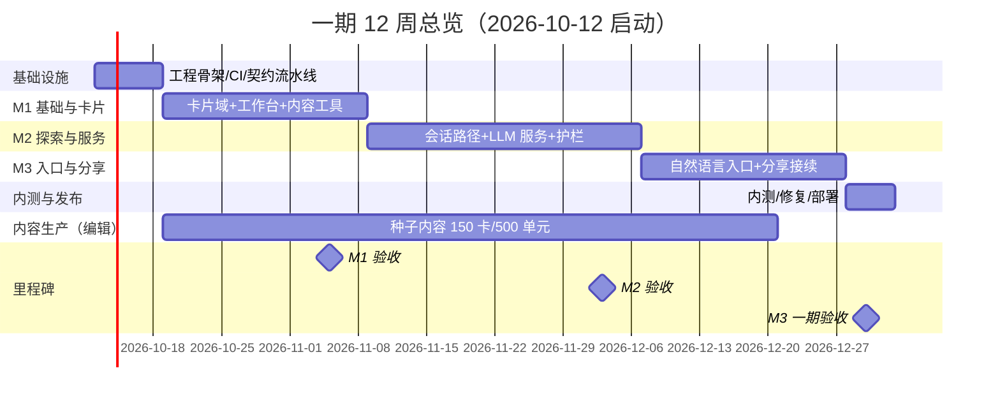

# 05 开发计划

> 输入：`01-需求拆解`（功能清单 / 优先级 / 验收 A1–A5 / 风险）、`02-技术架构`（选型 / 数据模型 / 关键流程 / 部署）、`03-原型设计说明`（界面与交互）、`04-主题与UI规范`（v1.1 纸墨编辑部 / Token / 组件）。
> 定位：**一期 MVP（12 周）的执行计划**——周/人粒度任务分解、里程碑验收、协作流程、测试与上线。基线：3 名开发 + 1 名兼职编辑，Java 模块化单体 + Vue3 双端，与 02 文档一致。
> 日历基线：假设 **2026-10-12（周一，国庆假期后）启动**，整体平移不影响任务结构；W12 跨元旦，内测放量提前至 W12 周一。

---

## 1. 总览

| 项 | 内容 |
|----|------|
| 目标 | 交付 01 文档 §1 的五条验收（A1–A5），内测 30–50 人跑通 §4 全旅程 |
| 团队 | 开发 A（后端·内容域）/ 开发 B（后端·智能域）/ 开发 C（前端·双端）/ 编辑（兼职，内容生产） |
| 周期 | 12 周，3 个里程碑：M1 基础与卡片（W1–W4）· M2 探索与服务（W5–W8）· M3 入口与分享（W9–W12） |
| 节奏 | 每日 15 分钟站会；**每周五可运行演示**；里程碑周周四验收评审；任务编号 `T-周-序号`，挂 FR 编号 |
| 硬纪律 | ① 接口先行（OpenAPI 冻结窗口见 §5）；② 核心路径必须有自动化测试（02 文档 §3 测试要求）；③ 内容生产与开发并行（R3 应对，编辑产出纳入排期） |

---

## 2. 人员与分工

| 角色 | 负责域 | 关键交付 | 互备 |
|------|-------|---------|------|
| 开发 A（后端·内容域） | 账户/RBAC、卡片与版本状态机、审核流、知识资产与导入、埋点、看板数据 | `/wb/*` 全部 API、卡片/检索 API | 与 B 互备 LLM 网关 |
| 开发 B（后端·智能域） | LLM 网关、讲解/整理服务、引用校验、配额、会话与路径树、自然语言入口、分享快照 | `agent_run` 流水线、`sessions/entries/shares` API | 与 A 互备工作台 CRUD |
| 开发 C（前端·双端） | 探索端 H5、分享页、工作台、shared 组件库与 Token/SVG 图标落地 | 双端全部界面（Vant/EP 标准件覆盖 ≥80%） | 承担联调与走查（§13 清单） |
| 编辑（兼职） | 种子内容生产、出处核验、审核 | 每专题 30–50 卡 + 1 任务卡；知识单元累计 500；内测内容修正 | 依赖 W2 起的内容工具 |

> 前端仅 1 人可行的前提（02 文档 §8）：工作台用 Element Plus 标准件、探索端复用 shared 语义组件、API 层 openapi-generator 自动生成——**开发 C 在 W1 必须先落组件库与生成链路，再写页面**。

---

## 3. 周任务分解（WBS）

> 格式：任务（关联需求）。演示=周五对全组跑可运行版本。★=该周关键路径。

### W1（10-12 ~ 10-16）工程骨架与模型定稿
| 人 | 任务 |
|----|------|
| A ★ | Maven 多模块骨架（ke-domain/infra/service/boot）+ Flyway 基线（核心表 v1：user/card/card_version/entry/knowledge_asset/citation）+ 注册登录（手机验证码/账号密码，FR-U01）+ JWT 过滤器链 |
| B | 表结构评审共建 + LLM 网关封装（Spring AI 双 ChatClient、`ModelCatalog`、MockWebServer 骨架，02 §5.2）+ `agent_run` 表 + `@Async` 虚拟线程执行器与心跳回收骨架 |
| C ★ | pnpm monorepo（shared/explorer/workbench）+ `tokens.css` 与 UI 规范落地（04 §11）+ shared 语义组件（ClaimBadge/CitationTag/SourceList/PhaseTag）+ SVG 图标集 sprite + openapi-generator 接入 |
| 编辑 | 专题 1（书院地标）资料收集：来源清单、授权状态、卡片选题草案 |
| 演示 | 登录注册跑通；双端空壳应用；CI（Maven test + pnpm build + stylelint 裸色值检查）全绿 |

### W2（10-19 ~ 10-23）卡片域核心 ★ 关键路径
| 人 | 任务 |
|----|------|
| A ★ | 卡片 CRUD + 版本不可变（只允许 INSERT）+ 状态机 draft→pending→published→disabled（FR-C07/C08）+ 卡片详情含入口只读列表（排序/收起字段，FR-E02；入口完整 CRUD 在 W9）+ 审核流 API（FR-O03）+ 知识单元 CSV 批量导入与定位信息（FR-O01/O02） |
| B | 讲解服务流水线 v1（路由→受限检索→生成→校验）以 mock 卡片数据打通；结构化输出 record（summary/sections/claim_type/citations/open_questions/evidence_gaps） |
| C | 工作台：卡片管理页（表格/筛选/详情抽屉/版本历史）+ 审核中心 v1；探索端首页（专题格/搜索壳/继续探索卡静态位） |
| 编辑 | 专题 1 知识单元 100 条入库（用导入工具）+ 卡片草稿 10 张 |
| 演示 | **编辑建卡→送审→发布→移动端可见**（M1 核心链路首次打通） |

### W3（10-26 ~ 10-30）四模板与服务真跑
| 人 | 任务 |
|----|------|
| A | 4 模板 `content_json` POJO + jakarta.validation 写入校验（02 §4.3）+ 专题浏览/关键词搜索（PG 全文，FR-C01/C02）+ 收藏（FR-C10） |
| B ★ | 引用校验器（越界剥离降级归纳）+ 敏感词 DFA + 生成标识追加 + token/成本计量（FR-S05/S13；01 R2 应对）+ 讲解服务切真实云 API |
| C | 探索端卡片页四模板渲染器（TextCard/CompareCard/TimelineCard/TaskCard，按模板分发）+ 来源依据/出处清单组件 + 服务栏三键（FR-S01） |
| 编辑 | 专题 1 卡片累计 20 张；知识单元累计 200 |
| 演示 | 四模板移动端完整渲染；讲解服务真实 API 结果（分段可信标识 + 出处可点） |

### W4（11-02 ~ 11-06）M1 收口
| 人 | 任务 |
|----|------|
| A | 8 类埋点事件落库（01 §5：session_start/node_visit/service_run/artifact_save/share_create/share_view/share_continue/entry_create/favorite）+ 审核台 3 步操作优化 + RBAC 完备（@PreAuthorize + 资源 ACL，FR-U03） |
| B | 用户日限额（Redis INCR，FR-S10）+ Resilience4j 60s 超时与卡死回收（FR-S04） |
| C | 探索端「我的」（个人空间/收藏，FR-U02）+ 工作台数据看板壳 + 走查修整（04 §13 清单过一遍） |
| 编辑 | 专题 1 收口 30–50 卡（含入口与出处）；专题 2（湘菜风物）启动 |
| **验收** | **M1（周四 11-05）**：①编辑在工作台建卡并发布；②移动端能浏览专题与卡片（01 §8）。演练脚本见 §4 |

### W5（11-09 ~ 11-13）会话与路径树
| 人 | 任务 |
|----|------|
| A ★ | `exploration_session`/`path_node` API + 访问落库（FR-E03）+ PG 递归 CTE 子树查询 + 断点续探恢复（FR-E01/E04） |
| B | 会话上下文摘要（小模型）+ 讲解服务上下文组装（仅当前会话，FR-E11）+ 追问链路（FR-E08） |
| C | 探索端路径页（树渲染/回退/分支标记）+ 二级页顶栏（返回+面包屑+指南针）+ 追问条与上下文条 |
| 编辑 | 专题 2 卡片累计 15 |
| 演示 | **A1 场景**：一次会话 ≥3 次有出处的有效深入 |

### W6（11-16 ~ 11-20）档位、停顿与成果整理
| 人 | 任务 |
|----|------|
| A | 解释三档（提示词预设 + 会话记住，FR-E10）+ 停顿操作 API（整理发现/未决疑问提取/换个方向，FR-E09）+ 重复访问提示（FR-E06 P1 顺手） |
| B ★ | 成果整理服务 v1（勾选节点→报告：关键发现/未决问题/分支视图，FR-S03）+ `artifact` 落库 |
| C | 讲解卡结果页（徽标/角标/证据缺口/继续问引导）+ 档位切换 + 停顿三键 + 成果整理页 v1（跨分支勾选，FR-E07） |
| 编辑 | 专题 2 收口 30 卡 |
| 演示 | **A2 场景**：回到历史节点产生新分支，原分支不受影响 |

### W7（11-23 ~ 11-27）比较模板与服务护栏
| 人 | 任务 |
|----|------|
| A | 卡片间关系入口（四类关系标签 + 跨主题必填关系说明与出处，FR-C09）+ 对比卡生成配置 |
| B | 「帮我比较」= 讲解对比模板输出（FR-S06 一期形态）+ 服务运行记录完善 + 失败重试/不丢路径全链路 |
| C | 对比卡渲染（维度×对象，移动端横滚+对象吸顶）+ 执行态页可离开 + 失败/超时错误态（04 §8.4 文案模板） |
| 编辑 | 专题 3（声音科学）卡片 15 |
| 演示 | 对比卡 + 服务失败重试路径无损 |

### W8（11-30 ~ 12-04）M2 收口
| 人 | 任务 |
|----|------|
| A | Testcontainers 集成测试补全（路径树/权限过滤/状态机）+ 性能调优（卡片首屏 ≤1.5s，01 §5） |
| B ★ | LLM mock 全场景用例（超时/坏 JSON/引用越界，02 §12.4）+ 单次成本监控告警（R5） |
| C | 埋点前端接入全量 + 分享页壳（免登录路由独立 chunk）+ 缓冲修整 |
| 编辑 | 专题 3 收口 25 卡 + 专题 1 任务卡（60 分钟家庭路线，FR-C06/E13） |
| **验收** | **M2（周四 12-03）**：①A1、A2 通过；②服务出处可点；③埋点 6 指标数据就绪 |

### W9（12-07 ~ 12-11）自然语言入口 ★ 最高风险周
| 人 | 任务 |
|----|------|
| A | 入口 CRUD/版本/停用 + 私人/公共范围 + 个人空间挂接（FR-N04/N05/N08 一期两动作） |
| B ★ | 意图分类（4 类白名单枚举）+ 结构化抽取 + `EntryConfigValidator`（服务白名单+资料范围硬校验，FR-N01/N07）+ 试运行（真实执行一次，FR-N03） |
| C | 新增入口四步流（一句话→配置草稿全可编辑→试运行预览→保存/送审，FR-N02/N06 最多追问 1 轮）+ 工作台入口编排页（步骤条+已有入口表+试运行合格率） |
| 编辑 | 三专题任务卡补全；未决问题清单整理（供成果整理样例） |
| 演示 | **A3 场景**：一句话 ≤30s 出可编辑配置 + 试运行成功；私人入口保存即用 |
| 预案 | 试运行成功率 <60% → 当周决策启用降级：入口位回收为模板入口 + 手动表单（01 R1），不堵 M3 |

### W10（12-14 ~ 12-18）分享与接续
| 人 | 任务 |
|----|------|
| A ★ | 分享创建（选节点/编辑标题摘要）+ **快照权限过滤**（ke-domain 纯函数穷举单测，02 §9）+ 不可变快照存储 + nanoid token/撤销（FR-H01–H03/H06） |
| B | 接续副本（复制 session + `origin_share_id`）+ 重跑差异提示（FR-H05/H07 一期简化）+ 分享页数据 API（permitAll） |
| C | 分享设置页（自动移除私密内容提示条）+ 接收者视角页（路径时间线 + 「沿此路径继续」= 副本说明）+ 分享页首屏 ≤50KB gz 验证 |
| 编辑 | 全量内容复核：出处定位、授权状态与到期 |
| 演示 | **A4+A5 场景**：公开链接免登录浏览；接续生成副本，原路径零变更 |

### W11（12-21 ~ 12-25）收口与内测准备
| 人 | 任务 |
|----|------|
| A | 配额管理 API（FR-U05）+ 看板 6 指标出数（FR-O05）+ 反馈通道（客服/群替代，FR-O04 一期） |
| B | 成果整理完善（跨分支合并终验）+ 全链路压测（讲解服务百级并发虚拟线程验证，02 §5.1）+ 结果缓存开启评估（FR-S11 二期默认关） |
| C | 配额页（可视化+超额文案）+ 看板页 + **§4 七步全旅程手动 E2E 脚本**逐条跑通 + 内测 H5 链接与引导文案 |
| 编辑 | 种子内容终审达成：**150 卡 / 500 知识单元**（01 §6 最小启动量） |
| 演示 | 全旅程串通彩排（= 01 §4 验收脚本） |

### W12（12-28 ~ 01-01，跨元旦）内测与发布
| 人 | 任务 |
|----|------|
| 全员 | **周一 12-28 内测放量（30–50 人）**；缺陷分级：P0 当天修 / P1 本周修 / P2 入二期清单 |
| A | 生产部署（Docker Compose 单机，02 §10.1）+ PG 每日备份/WAL 归档 + 监控告警接通 |
| B | 指标日报（6 指标）+ 成本核对（单次 ≤¥0.03 目标，异常即启用分级/限额收紧） |
| C | 内测反馈 UI 修复 + 走查清单终检 |
| 编辑 | 内测内容错误修正（当天响应） |
| **验收** | **M3 / 一期验收（周三 12-30）**：A1–A5 全部通过 + 内测报告 + 生产环境稳定运行 48h |

---

## 4. 里程碑验收与演示脚本

每个里程碑周四评审，验收口径直接引用 01 文档，不另设标准：

| 里程碑 | 日期 | 验收清单（逐条勾选） | 演示脚本 |
|--------|------|---------------------|---------|
| M1 | 11-05 | ① 编辑账号在工作台完成 建卡→送审→通过→发布；② 移动端按专题浏览到该卡并完整渲染 4 模板；③ 知识单元导入含定位信息；④ 版本历史不可变抽查 | 编辑现场建一张对比卡并发布 → 手机扫码浏览 |
| M2 | 12-03 | ① A1：连续 3 次有出处的有效深入；② A2：回到节点建立分支且原分支不变；③ 讲解/比较结果出处可点、缺口有提示；④ 限额与超时护栏生效（演示超限 429 与超时重试）；⑤ 埋点 6 指标数据可查 | 01 §4 步骤 1–4 现场跑 |
| M3 | 12-30 | ① A3：一句话 ≤30s 出配置+试运行；② A4：分享链接免登录且内容与快照一致；③ A5：接续生成副本、原路径零变更；④ 配额页可用；⑤ 内测 30–50 人完成 §4 全旅程，P0 缺陷清零 | 01 §4 全部 7 步 + 接收者账号现场接续 |

---

## 5. 接口契约与协作流程（前端不被后端阻塞）

1. **OpenAPI 先行**：每周一为接口冻结窗口——本周要联调的端点，周一 12:00 前提交 swagger 注解/草稿，`openapi-generator` 重新生成 TS client 与类型，前端周一下午起即可对着**契约 mock**（Prism 或 EP 简易 mock）开发。
2. 变更纪律：契约变更必须走 PR + 双方确认，破坏性变更只允许在周一窗口；CI 加 openapi-diff 检查。
3. 错误码 envelope（code/message/traceId）与分页 cursor 全局统一（02 §7），W1 定稿。
4. 联调环境：dev 一套常驻（compose），前端本地指向 dev；数据每日重置脚本（种子数据由编辑生产内容同步）。

---

## 6. 测试与质量（对应 02 文档 §3 测试策略）

| 层 | 范围 | 门槛 |
|----|------|------|
| 单元测试 | ke-domain 纯函数：引用校验、快照权限过滤、状态机、EntryConfigValidator | 行覆盖 ≥80%，**无 Spring 依赖**（02 §4.4） |
| 集成测试 | Testcontainers（PG/Redis）：路径树递归 CTE、版本不可变触发器、配额并发、服务流水线 | 核心路径全绿才可合并 |
| LLM mock | MockWebServer 模拟 OpenAI 协议：正常/超时/坏 JSON/引用越界四类用例 | CI 内跑，不依赖真实 API |
| E2E | 01 §4 七步旅程脚本（W11 起每周五人工跑）+ 内测期每日跑 | 里程碑验收材料 |
| 性能 | 卡片首屏 ≤1.5s、服务完成 ≤20s、分享页首开 ≤2s（01 §5） | M2/M3 各压测一轮 |
| UI 走查 | 04 §13 十四项清单（对比度/无 emoji 控件图标/宋体层级等） | 每里程碑前由开发 C 执行 |

**DoD（任务完成定义）**：代码评审通过 + 单测/集成测试绿 + 契约同步 + 满足 FR 验收要点 + 涉及埋点的已上报 + 无裸色值（stylelint）。缺一不算完成。

---

## 7. 内容生产计划（编辑，与开发并行）

| 周次 | 产出 | 累计 |
|------|------|------|
| W1 | 专题 1 资料与选题草案 | — |
| W2–W4 | 专题 1（书院地标）30–50 卡 + 1 任务卡 + 知识单元 200 | 卡 30–50 / 单元 200 |
| W4–W6 | 专题 2（湘菜风物）30 卡 | 卡 60–80 / 单元 350 |
| W7–W8 | 专题 3（声音科学）25 卡 + 各专题任务卡 | 卡 85–105 / 单元 500 |
| W9–W10 | 补齐至 150 卡（入口配置与出处全覆盖）+ 全量复核 | 卡 150 / 单元 500 |
| W11 | 终审 + 内测样例数据（含跨主题对比案例：饮食×科学） | 达标 |
| W12 | 内测反馈修正 | — |

> 依赖与风险：W2 起才有导入工具 → W1 编辑先离线整理；专题 1 收口（W4）即验证「1 个专题跑通再复制」策略（R3），若单位产出不及预期，W5 起砍专题 3 至 15 卡保旅程完整。

---

## 8. 风险跟踪与缓冲（对齐 01 §7）

| 风险 | 计划内应对 | 触发点与动作 |
|------|-----------|-------------|
| R1 自然语言入口成功率 | W9 整周专注 + 白名单收窄 + 试运行即验收 | W9 周五成功率 <60% → 启用模板入口+手动表单降级，M3 不受阻 |
| R2 引用不实 | 引用校验器 W3 先行 + 纯函数单测 | 任何越界引用未剥离即为 P0 缺陷 |
| R3 内容成本 | 内容工具 W2 交付、编辑产出按周计量、专题 1 先跑通 | W4 专题 1 未收口 → 复盘产出速率，压缩专题 3 范围 |
| R4 路径模型返工 | ER 评审 W1 定稿 + 递归 CTE 集成测试 W5/W8 | — |
| R5 服务成本失控 | 模型分级 W1 起内建 + 计量 W3 + 告警 W8 | 单次 >¥0.05 连续出现 → 收紧输入 token 上限 |
| R6 微信内 H5 | 分享页 W8 起独立轻量 chunk，每周在微信内实测 | — |
| R8 合规 | 生成内容显著标识（W3 随校验链内建）+ 日志留存；**算法备案评估 W10 启动（外部流程周期长）** | 备案未完成不对外放量，仅限内测 |
| 计划缓冲 | 每里程碑周预留 1 天修整；W12 全员修缺陷；W9 为唯一无缓冲高风险周（故预案前置） | 里程碑延后 >3 天 → 裁 P1 需求保验收 |

---

## 9. 上线与环境

| 环境 | 用途 | 说明 |
|------|------|------|
| dev | 常驻联调 | compose 全套，数据每日重置 |
| prod | 内测起即生产 | 单机 4C8G（app + worker + PG/Redis/MinIO + Nginx，02 §10.1） |
| 发布 | trunk-based，短分支 + PR；CI 绿才可合并；镜像分层 jar，改代码只重传业务层 | 上线检查单：备份就绪 / 告警就绪 / 回滚 = 上一镜像 tag |

内测放量前检查单：A1–A5 通过 · P0 清零 · 限额与超时护栏生效 · 敏感词过滤开启 · 生成标识与日志留存开启 · 备份可恢复演练一次。

---

## 10. 需求覆盖追溯（P0 → 周次）

| 域 | 需求 → 周次 |
|----|------------|
| D1 卡片 | C01 W2–3 · C02 W3 · C03–C06 W3（A 校验/C 渲染）· C07/C08 W2 · C09 W7 · C10 W4 |
| D2 探索 | E01/E03/E04/E05 W5 · E02 W2/W5 · E07 W6/W11 · E08 W5–6 · E09 W6 · E10 W6 · E11 W6 · E12 W3/W6 · E13 W8（任务卡内容） |
| D3 服务 | S01 W3 · S02 W3–6 · S03 W6/W11 · S04 W1/W4 · S05 W3/W6 · S06 W7（对比模板）· S10 W4 · S13 W7 |
| D4 入口 | N01–N07 W9（N08 一期两动作 W9） |
| D5 分享 | H01–H06 W10 |
| D6 运营 | O01/O02 W2 · O03 W2 · O05 埋点 W4 / 看板 W11 |
| D7 账户 | U01 W1 · U02 W4/W9 · U03 W4 · U05 W11 |

> 未列出的 P1/P2（E06、S07–S09、N09/N10、H07–H10、O04–O07、U04、C11–C14）不入一期排期；其中 E06、H07、O04 已在对应周「顺手做」标注，其余进二期需求池。

---

## 11. 项目管理机制

- **任务板**：GitHub Issues + Projects，任务编号 `T-周-序号`（如 `T3-2` = W3 任务 2），挂 FR 与里程碑标签。
- **站会**（15 分钟）：昨日 / 今日 / 阻塞——阻塞超 4 小时即升级到群里拉人。
- **周五演示**：必须可运行、连 dev 环境；演示不过的任务顺延并标注原因。
- **里程碑评审**：按 §4 清单逐条勾选，输出验收记录（作为 01 文档第九章验收的材料）。
- **缺陷分级**：P0 阻断验收当天修；P1 本里程碑内修；P2 进二期池。
- **周报**（A 执笔轮值）：进度对里程碑偏差、风险表变动、下周关键路径，周一发。
